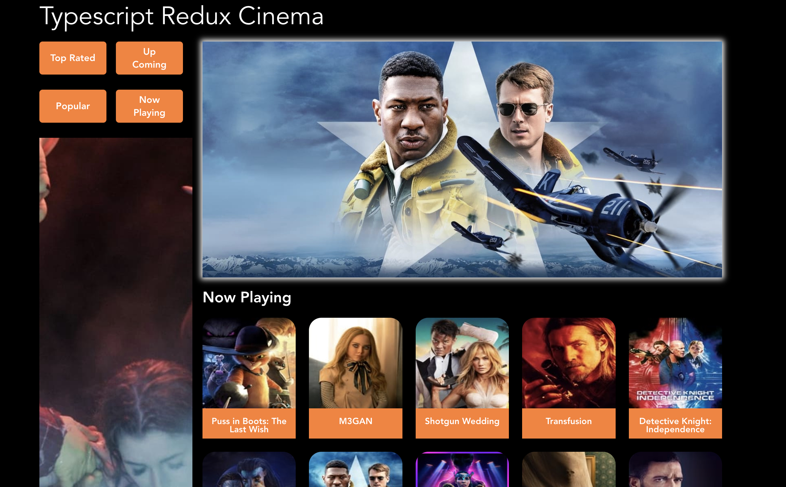

# TypeScript Cinema
## Goal

Our goal is to create a React/Redux app to browse movies using the [The Movie Db API](https://developers.themoviedb.org/3/getting-started/introduction).

## Visual


## Install

Install [npm](https://npmjs.org/) run

```
$ npm install -g npm
```

Install [Node](https://nodejs.org/en/download/)

## Usage
Clone Repo to your local machine

```
git clone https://github.com/jwinnfeild2517/typescript-cinema.git
```
Install Dependencies
```
npm install
```

start the development server
```
npm run dev
```

Open [http://localhost:5174](http://localhost:5174) to view it in the browser.